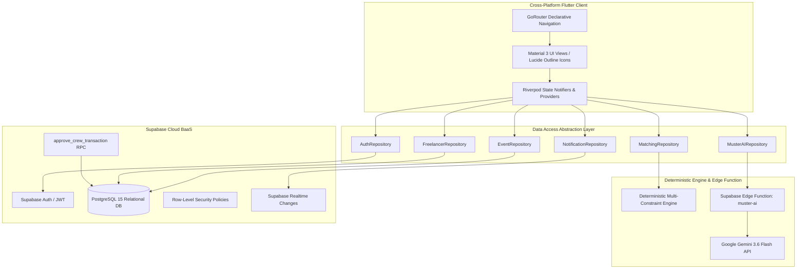

# MUSTER — AI-Powered Crew Assembly & Optimization Platform
**MIT India Hackathon 2026 | Track: PSE15 — AI-Powered Crew Assembly for Event Staffing**

[](https://flutter.dev)
[](https://dart.dev)
[](https://supabase.com)
[](https://ai.google.dev)
[](https://m3.material.io)
[](LICENSE)

---

## 📌 Problem Statement (PSE15)

Live events (concerts, technical conferences, expos, corporate summits) require assembling multidisciplinary freelance crews under rigid real-world constraints:
* **Strict Role Quotas**: Exact headcounts needed for Audio, Lighting, Rigging, and Stage Management.
* **Budget Ceilings**: Strict maximum spend limits with zero tolerance for cost overruns.
* **Transit & Proximity Limits**: Avoiding dispatch delays and excessive transit costs.
* **Reliability & Attendance Risk**: Minimizing no-shows using verified historical shift data.
* **Lack of Explainability**: Organizers distrust opaque automated tools without transparent justification.

**MUSTER** solves this by pairing a **deterministic multi-constraint optimization engine** with **Google Gemini 1.5 natural-language explainability** and **atomic Supabase database locking**.

---

## System Architecture



---

## ✨ Key Features

| Feature | Description |
| :--- | :--- |
| **Deterministic Multi-Constraint Solver** | Evaluates skill alignment, hourly rates, verified reliability, and transit distance to assemble valid rosters under hard budget caps. |
| **Google Gemini 1.5 Explainability** | Synthesizes natural-language rationales justifying why each specialist was selected over alternatives. |
| **Alternative Crew Permutations** | Instantly cycles through 3 Pareto-optimal trade-offs (*Balanced Fit*, *Budget-Optimized*, *High-Reliability Veterans*). |
| **Interactive Manual Selection** | Allows organizers to customize crew rosters with live dynamic budget calculations and constraint validation. |
| **Atomic Database Shift Locking** | Executes `approve_crew_transaction` stored procedure to prevent double-booking and lock confirmed rosters. |
| **Freelancer Shift Discovery & QR Pass** | Freelancers discover local shifts within their radius, submit rate bids, and receive confirmed digital dispatch tokens. |
| **Realtime Notifications Stream** | Instant updates across applicant actions, AI match completions, and confirmed shift dispatches. |
| **Zero Emoji Rule** | 100% professional vector iconography with `lucide_icons_flutter`. |

---

## 🚀 Quick Start Guide

### Prerequisites
* [Flutter SDK 3.27+](https://docs.flutter.dev/get-started/install)
* [Dart SDK 3.6+](https://dart.dev/get-dart)
* Chrome (for Web) or Android Studio / Device (for APK)

### 1. Clone & Install Dependencies
```bash
git clone https://github.com/your-username/muster.git
cd muster
flutter pub get
```

### 2. Run the Application
```bash
# Run Web in Chrome (Default)
flutter run -d chrome

# Run Android on connected device/emulator
flutter run -d android
```

### 3. Pre-Compiled Release Binaries
* **Android Release APK (54.0 MB)**: [`APK/MUSTER-v1.0.apk`](APK/MUSTER-v1.0.apk)
* **Web Production Bundle**: `build/web/`

---

## 🗄️ Database Setup (Supabase PostgreSQL)

MUSTER includes a complete, all-in-one setup SQL script containing all 13 tables, custom enums, RLS policies, auto-profile triggers, RPC stored procedures, and seed data:

1. Open your **[Supabase Dashboard](https://app.supabase.com)**.
2. Go to **SQL Editor** -> **+ New Query**.
3. Copy and paste the entire content from [`MUSTER_COMPLETE_SUPABASE_SETUP.sql`](MUSTER_COMPLETE_SUPABASE_SETUP.sql).
4. Click **Run** (`Ctrl + Enter`).

---

## ⚡ Supabase Edge Function & Gemini API

The Gemini API key is isolated server-side inside the Supabase Edge Function `muster-ai`:

```bash
# Deploy the Edge Function
supabase functions deploy muster-ai --project-ref <your-project-ref>

# Set the Gemini API Key Secret
supabase secrets set GEMINI_API_KEY=<your-gemini-api-key> --project-ref <your-project-ref>
```

---

## 📱 Demo & Judging Walkthrough

Follow this 2-minute flow during judging evaluation:

1. **Sign In**: Login as Organizer (`organizer@muster.events` / `password123`) or click **Demo Organizer Login**.
2. **Dashboard**: Inspect real-time operational metrics and active event cards.
3. **Create Event**: Open **Create Event** wizard -> click **Use AI Brief Assist** to auto-extract role quotas and budget limits with Gemini NLP.
4. **Applicant Pool**: Open **Applicant Pool** -> Filter candidates by role & sort by match score, hourly rate, or proximity.
5. **Run AI Matching**: Click **Run AI Matching** to trigger the deterministic solver and Gemini 1.5 explainability.
6. **Alternative Permutations**: Click **Find Another Crew** to observe real-time Pareto trade-offs (*Budget-Optimized* vs *High-Reliability*).
7. **Manual Selector**: Toggle **Select Manually** to demonstrate live interactive budget calculations.
8. **Approve Roster**: Click **Approve Crew Roster** to trigger the atomic PostgreSQL transaction.
9. **Freelancer Perspective**: Switch to Freelancer (`rohan.mehta@muster.events`) -> open **My Applications** to view the **Confirmed Dispatch Pass & QR Token**.

---

## 📂 Project Structure

```text
lib/
├── core/
│   ├── constants/app_constants.dart          # Colors, spacing, typography tokens
│   ├── services/ai_matching_service.dart     # Deterministic multi-constraint solver
│   ├── services/gemini_service.dart          # Gemini explainability client
│   ├── supabase/supabase_config.dart         # Supabase client configuration
│   ├── theme/app_theme.dart                  # Material 3 dark theme
│   └── utils/currency_formatter.dart         # INR (₹) formatting utilities
├── data/
│   ├── mock/mock_data.dart                   # Resilient fallback demo dataset
│   └── repositories/                         # Data access repositories
│       ├── auth_repository.dart
│       ├── event_repository.dart
│       ├── freelancer_repository.dart
│       ├── matching_repository.dart
│       ├── muster_ai_repository.dart
│       └── notification_repository.dart
├── features/
│   ├── auth/presentation/                    # Login & registration screens
│   ├── organizer/presentation/               # Dashboard, creation wizard, solver views
│   ├── freelancer/presentation/              # Discovery, shift status & QR pass views
│   ├── notifications/presentation/           # Realtime audit log stream
│   └── shell/presentation/app_shell.dart     # Adaptive navigation shell
├── models/                                   # Domain models
└── main.dart                                 # GoRouter configuration & entry point
```

---

## 📄 Documentation

* **[TECHNICAL_DOSSIER.md](TECHNICAL_DOSSIER.md)**: Comprehensive 40-section technical documentation covering architecture, mathematical formulas, RLS policies, schemas, and security.
* **[MUSTER_COMPLETE_SUPABASE_SETUP.sql](MUSTER_COMPLETE_SUPABASE_SETUP.sql)**: Master SQL schema and migration file.

---

## 👥 Team & Credits

Developed for **MIT India Hackathon 2026** — Track **PSE15: AI-Powered Crew Assembly for Event Staffing**.

* **License**: [MIT License](LICENSE)
